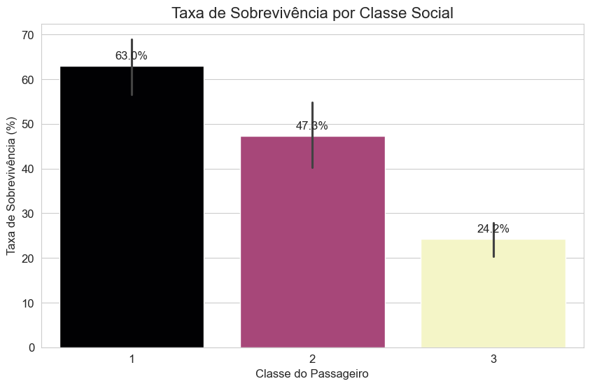
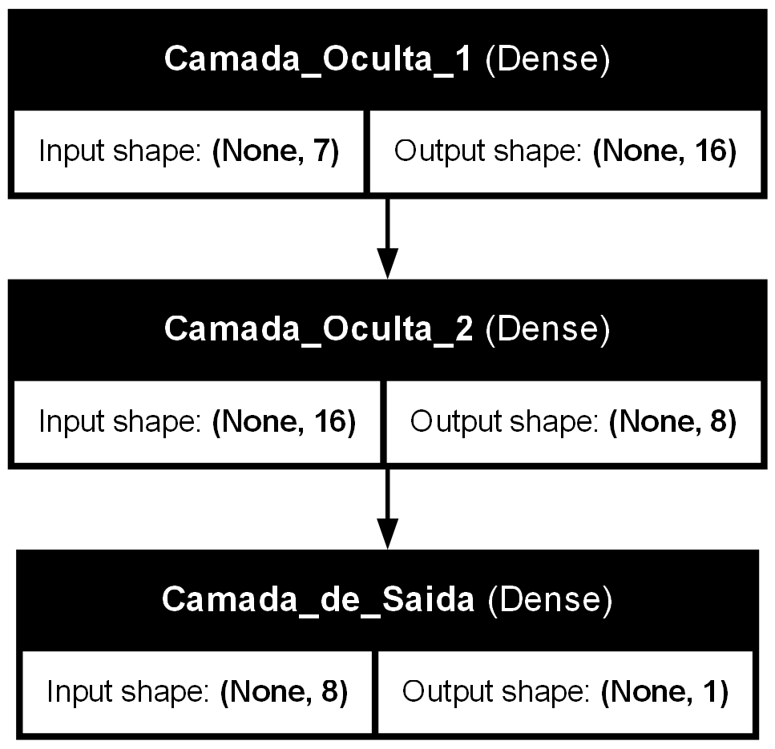

# Previsão de Sobreviventes do Titanic com Rede Neural

Este projeto utiliza uma Rede Neural Artificial (RNA) construída com TensorFlow e Keras para prever a sobrevivência de passageiros do naufrágio do Titanic, baseado nos dados da competição do Kaggle.

O script realiza um ciclo completo de um projeto de Machine Learning, desde a análise exploratória dos dados até a geração de um arquivo de submissão com as previsões finais.

---

## Storytelling: a história contada pelos dados
Antes de construir o modelo, realizamos uma Análise Exploratória dos Dados (EDA) para entender os fatores que influenciaram a sobrevivência.

### 1. O Cenário Geral: uma luta pela vida
A realidade foi dura: dos passageiros no nosso conjunto de treino, **apenas 38.4% sobreviveram**. A sobrevivência foi a exceção, não a regra.

### 2. "Mulheres e Crianças Primeiro" e a Divisão Social
O famoso código de conduta marítima e a condição socioeconômica foram fatores decisivos. Mulheres tiveram uma taxa de sobrevivência de **~74%** contra **~19%** dos homens. Passageiros da 1ª Classe tiveram **~63%** de chance de sobreviver, um contraste gritante com os **~24%** da 3ª Classe.

| Taxa de Sobrevivência por Gênero | Taxa de Sobrevivência por Classe |
| :---: | :---: |
|  |  |

A análise combinada revela que mulheres da 1ª Classe foram o grupo com maior chance de sobrevivência, enquanto homens da 3ª Classe representaram a vasta maioria das vítimas.

### 3. A Matemática Confirma a História
A matriz de correlação resume numericamente o que vimos. As características com maior impacto na sobrevivência foram o **Gênero (`Sex`)** e a **Classe do Passageiro (`Pclass`)**.

---

## Arquitetura do Modelo

Para este problema, utilizei uma Rede Neural do tipo **Multilayer Perceptron (MLP)**. É uma arquitetura *feedforward* e totalmente conectada, ideal para problemas de classificação tabular como este.

O fluxograma abaixo detalha a estrutura da rede:
- **1 Camada de Entrada** que recebe os 7 atributos dos passageiros.
- **2 Camadas Ocultas** com ativação ReLU, responsáveis por aprender os padrões nos dados.
- **1 Camada de Saída** com ativação Sigmoid, que resulta na probabilidade de sobrevivência (um valor entre 0 e 1).

---

### Visão Geral da Arquitetura (Fluxo de Dados)

A representação esquemática abaixo ilustra como os dados de um passageiro fluem através da rede para gerar uma previsão final.

## Desempenho do Modelo

Após o treinamento, avaliamos a performance da Rede Neural. O modelo aprendeu a generalizar os padrões em vez de apenas decorar os dados, como mostram as curvas de acurácia e perda no gráfico abaixo.

A **Matriz de Confusão** mostra o raio-X dos acertos e erros do modelo no conjunto de validação, alcançando uma **acurácia final de ~82%**.

### Relatório de Classificação

O relatório abaixo detalha a performance do modelo para cada classe:

| Classe | Precision | Recall | F1-Score | Support |
| :--- | :---: | :---: | :---: | :---: |
| Não Sobreviveu | 0.81 | 0.90 | 0.86 | 105 |
| Sobreviveu | 0.84 | 0.70 | 0.76 | 74 |

---

## Como Executar o Projeto

1.  Clone este repositório: `git clone https://github.com/Cap-alfaMike/titanic-survival-eda-prediction-tensorflow.git`
2.  Navegue até a pasta do projeto: `cd titanic-survival-eda-prediction-tensorflow`
3.  Instale as dependências: `pip install pandas tensorflow scikit-learn matplotlib seaborn pydot graphviz`
4.  Coloque os arquivos `train.csv` e `test.csv` (baixados do Kaggle) na mesma pasta do script.
5.  Execute o script no terminal: `python titanic_tensorflow.py`